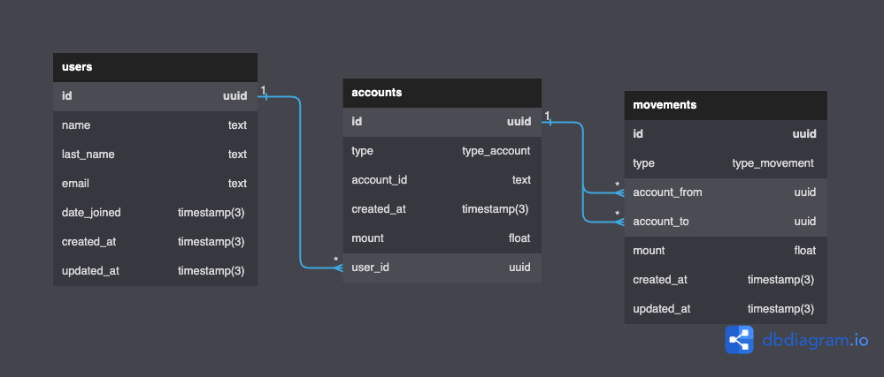

<p align="center" style="background-color:white">
 <a href="https://www.ravn.co/" rel="noopener">
 </a>
</p>
<p align="center">
 <a href="https://www.postgresql.org/" rel="noopener">
 </a>
</p>

---

<p align="center">A project to show off your skills on databases & SQL using a real database</p>

## 📝 Table of Contents

- [Case](#case)
- [Installation](#installation)
- [Data Recovery](#data_recovery)
- [Excersises](#excersises)

## 🤓 Case <a name = "case"></a>

As a developer and expert on SQL, you were contacted by a company that needs your help to manage their database which runs on PostgreSQL. The database provided contains four entities: Employee, Office, Countries and States. The company has different headquarters in various places around the world, in turn, each headquarters has a group of employees of which it is hierarchically organized and each employee may have a supervisor. You are also provided with the following Entity Relationship Diagram (ERD)

#### ERD - Diagram <br>

 <br>

---

## 🛠️ Docker Installation <a name = "installation"></a>

1. Install [docker](https://docs.docker.com/engine/install/)

---

## 📚 Recover the data to your machine <a name = "data_recovery"></a>

Open your terminal and run the follows commands:

1. This will create a container for postgresql:

```
docker run --name nerdery-container -e POSTGRES_PASSWORD=password123 -p 5432:5432 -d --rm postgres:15.2
```

2. Now, we access the container:

```
docker exec -it -u postgres nerdery-container psql
```

3. Create the database:

```
create database nerdery_challenge;
```

5. Close the database connection:
```
\q
```

4. Restore de postgres backup file

```
cat /.../dump.sql | docker exec -i nerdery-container psql -U postgres -d nerdery_challenge
```

- Note: The `...` mean the location where the src folder is located on your computer
- Your data is now on your database to use for the challenge

---

## 📊 Excersises <a name = "excersises"></a>

Now it's your turn to write SQL queries to achieve the following results (You need to write the query in the section `Your query here` on each question):

1. Total money of all the accounts group by types.

```
SELECT type, SUM(mount) AS mount_per_type FROM accounts GROUP BY type;
```


2. How many users with at least 2 `CURRENT_ACCOUNT`.

```
WITH UsersGroupedBy AS
(SELECT users.name, 
COUNT(accounts.user_id)  as total_users_count FROM users LEFT JOIN accounts ON users.id = accounts.user_id 
WHERE accounts.type = 'CURRENT_ACCOUNT' GROUP BY users.name 
    HAVING COUNT(accounts.user_id) >= 2
)
SELECT COUNT(name) FROM UsersGroupedBy;
```


3. List the top five accounts with more money.

```
SELECT * FROM accounts ORDER BY mount DESC LIMIT 5;
```


4. Get the three users with the most money after making movements.

```
WITH account_balances AS (
  SELECT
    a.id,
    a.user_id,
    a.mount 
      + COALESCE(SUM(CASE WHEN m.account_to = a.id THEN m.mount ELSE 0 END), 0)
      + COALESCE(SUM(CASE WHEN m.account_from = a.id AND m.type = 'IN' THEN m.mount ELSE 0 END), 0)
      - COALESCE(SUM(CASE WHEN m.account_from = a.id AND m.type IN ('OUT', 'OTHER') THEN m.mount ELSE 0 END), 0)
      - COALESCE(SUM(CASE WHEN m.account_from = a.id AND m.type = 'TRANSFER' THEN m.mount ELSE 0 END), 0) AS final_balance
  FROM accounts a
  LEFT JOIN movements m ON m.account_to = a.id OR m.account_from = a.id
  GROUP BY a.id, a.user_id, a.mount
)
SELECT u.name, u.last_name, u.email, SUM(ab.final_balance) AS total_balance, u.id 
FROM account_balances ab
LEFT JOIN users u ON ab.user_id = u.id
GROUP BY u.name, u.last_name, u.email, u.id 
ORDER BY total_balance DESC 
LIMIT 3;

```


5. In this part you need to create a transaction with the following steps:

    a. First, get the ammount for the account `3b79e403-c788-495a-a8ca-86ad7643afaf` and `fd244313-36e5-4a17-a27c-f8265bc46590` after all their movements.
    ```

BEGIN;

DROP FUNCTION IF EXISTS get_total_money(UUID);
CREATE OR REPLACE FUNCTION get_total_money(s_account_id UUID)
RETURNS DOUBLE PRECISION
LANGUAGE plpgsql
AS
$$
DECLARE
    final_amount DOUBLE PRECISION;
BEGIN
    SELECT
        a.mount
        + COALESCE(SUM(CASE WHEN m.account_to = a.id THEN m.mount ELSE 0 END), 0)
        + COALESCE(SUM(CASE WHEN m.account_from = a.id AND m.type = 'IN' THEN m.mount ELSE 0 END), 0)
        - COALESCE(SUM(CASE WHEN m.account_from = a.id AND m.type IN ('OUT', 'OTHER') THEN m.mount ELSE 0 END), 0)
        - COALESCE(SUM(CASE WHEN m.account_from = a.id AND m.type = 'TRANSFER' THEN m.mount ELSE 0 END), 0)
    INTO final_amount
    FROM accounts a
    LEFT JOIN movements m
        ON m.account_to = a.id
        OR m.account_from = a.id
    WHERE a.id = s_account_id
    GROUP BY a.id, a.mount;

    RETURN final_amount;
END;
$$;

    ```
    
    b. Add a new movement with the information:
        from: `3b79e403-c788-495a-a8ca-86ad7643afaf` make a transfer to `fd244313-36e5-4a17-a27c-f8265bc46590`
        mount: 50.75
    
    ```
    INSERT INTO movements(id, type, account_from, account_to, mount, created_at, updated_at)
    VALUES('426647b2-9abd-4b9a-a987-624022b37437', 'TRANSFER', '3b79e403-c788-495a-a8ca-86ad7643afaf', 'fd244313-36e5-4a17-a27c-f8265bc46590', 50.75, NOW(), NOW());

    ```

    c. Add a new movement with the information:
        from: `3b79e403-c788-495a-a8ca-86ad7643afaf` 
        type: OUT
        mount: 731823.56
    ```
    INSERT INTO movements(id, type,account_from,account_to,mount, created_at,updated_at)
    VALUES('61b11806-d674-44e3-97db-2aaba41f5784','OUT','3b79e403-c788-495a-a8ca-86ad7643afaf','fd244313-36e5-4a17-a27c-f8265bc46590',731823.56,NOW(),NOW());
    ```

        * Note: if the account does not have enough money you need to reject this insert and make a rollback for the entire transaction
    
    d. Put your answer here if the transaction fails(YES/NO):
    ```
    YES (It does not fail directly but in a financial context an account should not be in negative numbers or at least not allow a transfer if the account's money ends up being negative)
    ```

    e. If the transaction fails, make the correction on step _c_ to avoid the failure:
    ```
    INSERT INTO movements(id, type,account_from,account_to,mount, created_at,updated_at)
    VALUES('61b11806-d674-44e3-97db-2aaba41f5784','OUT','3b79e403-c788-495a-a8ca-86ad7643afaf','fd244313-36e5-4a17-a27c-f8265bc46590',10,NOW(),NOW());
    ```

    f. Once the transaction is correct, make a commit
    ```
    COMMIT;
    ```

    e. How much money the account `fd244313-36e5-4a17-a27c-f8265bc46590` have:
    ```
    SELECT get_total_money('fd244313-36e5-4a17-a27c-f8265bc46590');
    ```


6. All the movements and the user information with the account `3b79e403-c788-495a-a8ca-86ad7643afaf`

```
SELECT u.id, u.name, u.last_name, u.email, m.id as movement_id, m.type as movement_type, m.account_from, m.account_to, m.mount, m.created_at as movement_created_at
FROM movements m
JOIN accounts a ON (a.id = m.account_from OR a.id = m.account_to)
JOIN users u ON u.id = a.user_id
WHERE a.id = '3b79e403-c788-495a-a8ca-86ad7643afaf';
```


7. The name and email of the user with the highest money in all his/her accounts

It says just the user with the highest money in her accounts 
no movements mentioned

```
-- Query without considering movements

SELECT
    CONCAT(u.name, ' ', u.last_name) AS full_name,
    u.email,
    SUM(a.mount) AS total_money
FROM users u
JOIN accounts a ON a.user_id = u.id
GROUP BY u.id, u.name, u.last_name, u.email
ORDER BY total_money DESC
LIMIT 1;

-- Query considering movements

WITH account_balances AS (
  SELECT
    a.id,
    a.user_id,
    a.mount 
      + COALESCE(SUM(CASE WHEN m.account_to = a.id THEN m.mount ELSE 0 END), 0)
      + COALESCE(SUM(CASE WHEN m.account_from = a.id AND m.type = 'IN' THEN m.mount ELSE 0 END), 0)
      - COALESCE(SUM(CASE WHEN m.account_from = a.id AND m.type IN ('OUT', 'OTHER') THEN m.mount ELSE 0 END), 0)
      - COALESCE(SUM(CASE WHEN m.account_from = a.id AND m.type = 'TRANSFER' THEN m.mount ELSE 0 END), 0) AS final_balance
  FROM accounts a
  LEFT JOIN movements m ON m.account_to = a.id OR m.account_from = a.id
  GROUP BY a.id, a.user_id, a.mount
)
SELECT CONCAT(u.name,' ', u.last_name) AS full_name, u.email, SUM(ab.final_balance) AS total_balance
FROM account_balances ab
LEFT JOIN users u ON ab.user_id = u.id
GROUP BY u.name, u.last_name, u.email, u.id 
ORDER BY total_balance DESC 
LIMIT 1;

```


8. Show all the movements for the user `Kaden.Gusikowski@gmail.com` order by account type and created_at on the movements table

```
SELECT m.*, a.type as account_type
FROM movements m
JOIN accounts a ON (a.id = m.account_from OR a.id = m.account_to)
JOIN users u ON u.id = a.user_id
WHERE u.email = 'Kaden.Gusikowski@gmail.com'
ORDER BY a.type, m.created_at;
```